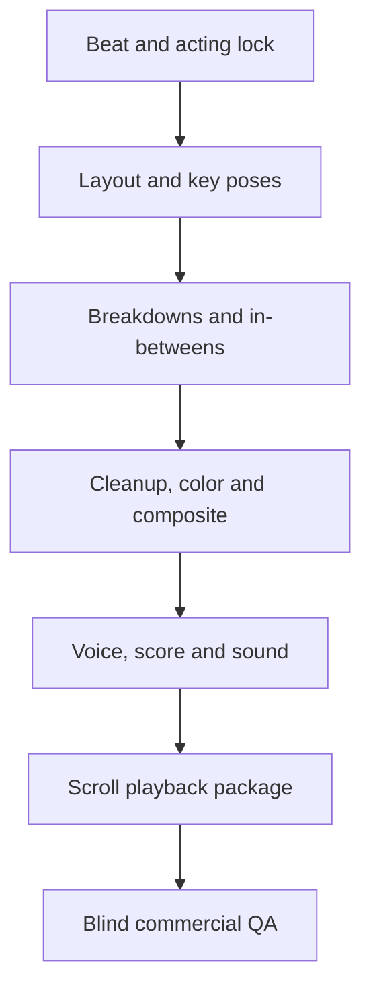

# DESPERADO EP01 — Global Moving-Toon Research and Rebuild Architecture v3.0

Status: **DESIGN LOCK CANDIDATE — prior pilot rejected**  
Decision date: 2026-09-14  
Scope: mobile-first vertical motion comic, scroll-controlled playback, commercial art/audio bar

## Executive decision

There is no defensible single “best moving webtoon” across every dimension. The strongest reference model is a benchmark stack:

1. **SBS / Matt Huynh, _The Boat_** is the lead reference for authored scroll rhythm, painterly art, environmental motion and sound-led immersion. It adapts a 49-page story with 222 hand-painted illustrations and 59 animated sequences; SBS describes the project as combining hand-drawn art, animation, text, sound and archive. Its storm, shake, depth and sound all express the protagonist’s physical experience rather than decorate a static page.[1][2][3]
2. **WEBTOON Video Episodes** is the current reference for the audience expectation created by the phrase “a comic coming alive”: dynamic character motion, music, sound and real voice acting. It is closer to short-form animation than to parallax panels.[4]
3. **Madefire Motion Books** remains the clearest formal precedent for preserving comic composition while adding sound, motion and depth.[5]
4. **Marvel Infinity Comics and DC GO!** are useful for phone-first vertical composition, bite-sized beats and legibility, but their official descriptions primarily establish a vertical scrolling format—not a complete animation standard.[6][7][8]

Therefore DESPERADO must not be built as “webtoon panels with zoom.” It must be produced as **eight short animated shots whose playback head is controlled by scroll**, with comic typography and vertical pacing wrapped around them.

The current deployment fails this definition. Its eight still frames per scene create pose stepping, not acting. Camera transforms dominate because there are too few coherent drawings between poses. The sound bed is synthetic and sparse, so it does not supply dramatic continuity. The result reads as a slideshow or animatic.

## 1. Benchmark findings

| Reference | What it proves | Adopt | Do not mistake it for |
|---|---|---|---|
| _The Boat_ | Scroll can become embodied pacing; art, FX and sound form one system | atmosphere, authored holds, occlusion, sound bridges, finished paused frames | a reusable visual skin |
| WEBTOON Video Episodes | “Moving comic” now implies acting plus voice/music/SFX | body/facial acting, professional mix, 2–5 second shot grammar | reader-controlled scroll by itself |
| Madefire | Motion, depth and sound can preserve comic composition | layered depth, panel reveal, spatial sound | tap-by-tap page turns |
| Marvel Infinity | Strong mobile crop, vertical beat flow | silhouettes, balloons, reveal order | a complete animation standard |
| DC GO! | Fast character-led mobile sessions | compact scenes and immediate hooks | motion merely because it scrolls |

The decisive quality is **temporal continuity**: notice → anticipation → movement → contact → resistance → reaction. Eyes lead the head, the head leads the torso, and cloth/hair settle afterward. A prop changes because a character acts on it. Sound enters before, on, or after the picture deliberately. A zoom may support that chain, but cannot replace it.

## 2. Why the rejected pilot fails

| Failure | Current evidence | Result | Correction |
|---|---|---|---|
| Eight frames per scene | `assets/ep01-frames/sc00…sc07` | pose popping/slideshow | 48–96 authored frames or coherent 2–4 s animation per scene |
| No true in-betweens | large pose/crop jumps | identity drift and teleporting limbs | model sheets, keys, breakdowns, in-betweens, cleanup |
| Camera substitutes for acting | push/pan/scale carries visual change | zoom-in/zoom-out impression | action must read with camera frozen |
| Weak sound continuum | procedural bed plus isolated cues | empty, cheap, disconnected | composed score, room tone, Foley, designed impacts, directed voices |
| Insufficient mechanics | storyboard names effects, not frame mechanics | inconsistent motion | exposure sheet with frame ranges, contacts, settles, lips, eyes, FX |
| Wrong QA target | code passed while blind viewing failed | false commercial PASS | blind first-view gate overrides automation |

## 3. Product definition

A DESPERADO scene passes only when all are true:

- Continuous 2–4 second narrative action on a 24 fps timeline.
- At least four phases: anticipation, action, contact/turn, settle/reaction.
- Character or prop changes independently of the camera.
- Scroll down advances; stopping freezes; reverse scroll reverses visual action.
- Camera normally stays within 6% scale and 4% translation.
- First, midpoint and final frames each pass as finished webtoon panels.
- After opt-in, sound includes room tone, music, Foley/SFX and scripted voice.
- No CSS-drawn person, eye, hand, door, gun or story prop.

Experience targets: 9:16 at 1080×1920 master; 720×1280 fallback; 8.0–9.5 total viewports; short scenes 0.55–0.8 viewport; normal scenes 0.9–1.15; 20–28 seconds total animation; 24 fps logical timeline; visual input latency under 100 ms; zero frame drift after 120 ms idle.

## 4. Rebuild production model

Front-end integration begins only after one golden scene passes with its camera transform disabled.

### 4.1 Animation assets

Preferred hierarchy:

1. Artist-authored layered 2D animation in Toon Boom/After Effects/Blender Grease Pencil, delivered as image sequences and clean stems.
2. Assisted route: approved key art → controlled image-to-video for motion reference → manual selection, paint-over, identity/hand cleanup and compositing. Raw generated video is never shipped.
3. Rejected: contact sheets split into eight unrelated frames, interpolation used as a substitute for acting, or scale/parallax hiding missing motion.

Every shot includes `BG`, `MG`, `FG_OCCLUSION`, character body groups, face/eye/mouth replacements, interaction hands/props, light/FX mattes and shadow pass; 5–8 keys, 4–8 breakdowns and sufficient in-betweens; three hero stills; alpha-safe edges; 8% overscan; locked turnaround/expression/hand sheets.

### 4.2 Scroll renderer

Use a **hybrid image-sequence renderer** rather than ordinary video seeking as the correctness path.

- AVIF/WebP sequence per scene on a 24 fps logical timeline.
- Preload only previous/current/next scene, decode to `ImageBitmap`, render to one DPR-aware canvas.
- `frameIndex = round(sceneProgress × (frameCount - 1))`.
- 60–100 ms damped playhead removes trackpad jitter without autonomous continuation.
- GSAP ScrollTrigger handles thresholds, direction, pin/enter/leave and cue crossings; its API supports scrub, pin, snap and trigger choreography.[9]
- CSS Scroll-driven Animations handle cheap atmosphere/UI only; MDN distinguishes scroll-progress and view-progress timelines.[10]
- Rive is limited to controls/loading UI, not painted human acting.[11]
- Reduced-motion mode uses complete still panels and fades.

Frame sequences are preferred initially because mobile `<video>.currentTime` can seek from keyframes imprecisely. All-intra video/WebCodecs can be evaluated later as a measured optimization.

### 4.3 Visual and audio clocks

Visual time reverses with scroll. Audio does not play backward. After explicit opt-in, Web Audio buses trigger forward events at threshold crossings. On reverse, ambience/score continues or transitions musically; voice and one-shots use hysteresis and 1.5–2.0 second cooldown. Web Audio provides gain graphs, filters, panning and accurate scheduling.[12]

## 5. EP01 shot design

| Scene | Duration / frames | Required acting | Camera/depth | Audio | Scroll |
|---|---:|---|---|---|---:|
| SC00 Rainy Seoul | 2.5 s / 60 | rain → traffic sweep → figure crossing → title | 3-plane city drift | composed low pulse, rain, tire wash, siren | 0.65 vh |
| SC01 Stop | 3.5 s / 84 | walk tail → hear → eye snap → hand rise → partner brakes → cloth settles | 3% push after stop | steps, cloth, HVAC, music duck, directed line | 1.10 vh |
| SC02 Threat | 2.8 s / 68 | reflection → heel enters → weight lands → second foot → shadow grows | low lateral track | distinct shoe Foley, corridor reflection, bass tick | 0.75 vh |
| SC03 Count two | 3.0 s / 72 | focus → blink → glance → lean/whisper → register | rack focus, 2% reframe | breath, whisper, score hold | 0.95 vh |
| SC04 Find exit | 2.8 s / 68 | listen → eye leads → chin follows → shoulder turns → hand reaches | foreground occlusion | low-pass steps, sleeve, tonal lift | 0.75 vh |
| SC05 Locked door | 2.2 s / 54 | reach → finger wrap → lever press → stop → recoil → reaction | static camera | glove rub, spring, latch impact, line | 0.85 vh |
| SC06 Silver Lily | 3.8 s / 92 | dark → relay flicker → mark scan → advance → exchange | 4-layer reveal, 4% push | relay, buzz, motif, Chano line | 1.15 vh |
| SC07 Hook | 2.5 s / 60 | light dies → pursuit shadow → turn → coat settle → logo | light sweep | pursuit bridge, impact, unresolved music | 0.80 vh |

Total: **558 logical frames, 8.0 viewport, approximately 23.1 seconds of animation**.

## 6. Audio design

Five mandatory stems: Music, Ambience, Foley, SFX and Voice. Music is a composed 45–60 second suspense cue with intro/pulse/reveal/unresolved tail—not an oscillator placeholder. Foley is performed or licensed and matched to perspective. Korean voices use locked casting and directed performances.

Mix targets: about −16 LUFS integrated; true peak ≤ −1 dBTP; music ducks 3–5 dB for dialogue; Foley contact lands within ±42 ms of contact frame; persistent mute after first-tap opt-in; full comprehension when muted.

## 7. Stack decision

| Technology | Decision |
|---|---|
| GSAP ScrollTrigger | primary orchestration |
| Canvas + ImageBitmap | primary exact-frame renderer |
| CSS scroll timelines | secondary atmosphere/UI |
| Web Audio API | primary audio engine |
| Rive | optional UI only |
| Playwright | automation gate, not art judge |
| WebCodecs/all-intra video | later performance experiment |

Playwright screenshot comparisons provide pixel regression against stored baselines, but cannot judge commercial art quality.[13] Human blind-view QA is mandatory.

## 8. Build gates

**Gate A — treatment:** reference stack, visual treatment, model sheets and rejection of prior assets are explicit.

**Gate B — golden scene:** build SC05 first. It must have 54 coherent frames, stable hand/lever anatomy, readable action with camera locked, exact freeze/reverse, Foley sync within one frame and unanimous blind classification as “animation/moving comic.” Failure returns it to animation; it does not trigger batch production.

**Gate C — full animation:** model sheets and environments lock before batch work; each scene passes frame 0/mid/end and full-speed/reverse review; all audio stems have ownership/licence evidence.

**Gate D — integration:** 8.0–9.5 viewport total; no scene over 1.15; no visible normal-read loading; real iOS Safari and Android Chrome memory/performance validation.

**Gate E — release:** Local QA → Visual QA → Scroll Fatigue → Reverse Scroll → Sound → Responsive → Performance → Deploy → Production URL Playwright → captured-frame Commercial Art QA.

Production PASS requires S/A issues = 0, unanimous blind moving-toon recognition, no placeholders/geometry people/broken anatomy/vacant scroll/camera-only scenes, and tested SHA = deployed SHA.

## 9. Resourcing and schedule

This is animation production, not a front-end enhancement. Minimum disciplines: director/storyboard, character/background art, 2D animation/cleanup, compositing, composer/sound design, Korean voice direction/actors, front-end engineering and independent art/QA review.

For eight shots, a realistic focused-team schedule is **4–6 weeks after design lock**. AI assistance can reduce calendar time but does not eliminate cleanup, art direction, audio rights or human review. A credible commercial completion claim requires all of them.

## 10. Execution order

1. Freeze current deployment as rejected and remove PASS language.
2. Produce character turnaround/expression/hand sheets and corridor/door/target environment sheets.
3. Rewrite storyboard as a 558-frame exposure sheet.
4. Produce SC05 as the golden scene with final audio pipeline.
5. Integrate SC05 into exact scroll-controlled playback and test real mobile devices.
6. Run blind recognition QA; continue only on PASS.
7. Produce seven remaining shots, mix the full score and replace the pilot.

## Conclusion

The project underperformed because it tried to solve an **animation problem with front-end motion effects**. The rebuild reverses that dependency: completed acting and sound are the product; scrolling is the transport. _The Boat_ supplies interaction and atmosphere, WEBTOON Video Episodes supplies the performance/audio bar, Madefire supplies comic-preserving motion grammar, and Marvel/DC supply mobile pacing.

## Sources

1. Matt Huynh, “[_The Boat_](https://www.matthuynh.com/stories/theboat-9rw43),” 2015.
2. SBS, “[SBS Online releases first-ever interactive graphic novel](https://www.sbs.com.au/aboutus/2015/04/29/sbs-online-releases-first-ever-interactive-graphic-novel/),” 29 April 2015.
3. Communication Arts, “[_The Boat_](https://www.commarts.com/project/23899/the-boat).”
4. WEBTOON Entertainment, “[WEBTOON Entertainment Brings Webcomics to Life with Video Episodes](https://www.businesswire.com/news/home/20250818319497/en/WEBTOON-Entertainment-Brings-Webcomics-to-Life-with-Video-Episodes),” 18 August 2025; [syndicated description](https://www.01net.it/webtoon-entertainment-brings-webcomics-to-life-with-video-episodes/).
5. Moving Brands, “[Madefire](https://movingbrands.com/work/madefire/).”
6. Marvel, “[Introducing Marvel’s Infinity Comics](https://www.marvel.com/articles/comics/read-marvel-infinity-comics-on-marvel-unlimited),” 9 September 2021.
7. Marvel, “[Start Scrolling Free Infinity Comics](https://www.marvel.com/articles/comics/marvel-unlimited-start-scrolling-free-infinity-comics),” 7 March 2024.
8. DC Universe Infinite, “[DC GO!](https://www.dcuniverseinfinite.com/).”
9. GreenSock, “[ScrollTrigger](https://gsap.com/docs/v3/Plugins/ScrollTrigger/).”
10. MDN, “[CSS scroll-driven animations](https://developer.mozilla.org/en-US/docs/Web/CSS/Guides/Scroll-driven_animations).”
11. Rive, “[Web runtime](https://rive.app/docs/runtimes/web/web-js).”
12. MDN, “[Web Audio API](https://developer.mozilla.org/en-US/docs/Web/API/Web_Audio_API).”
13. Microsoft Playwright, “[Visual comparisons](https://playwright.dev/docs/test-snapshots).”
